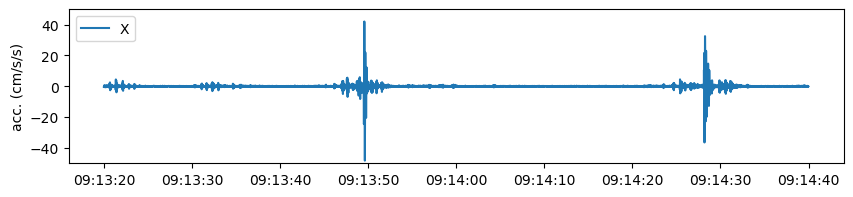
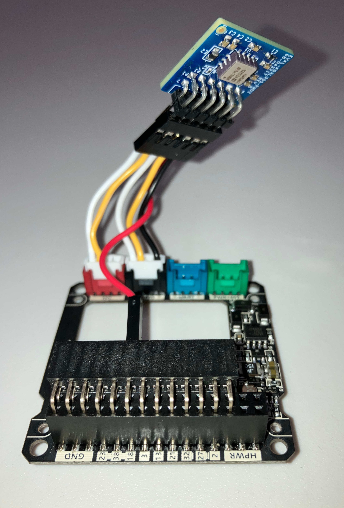
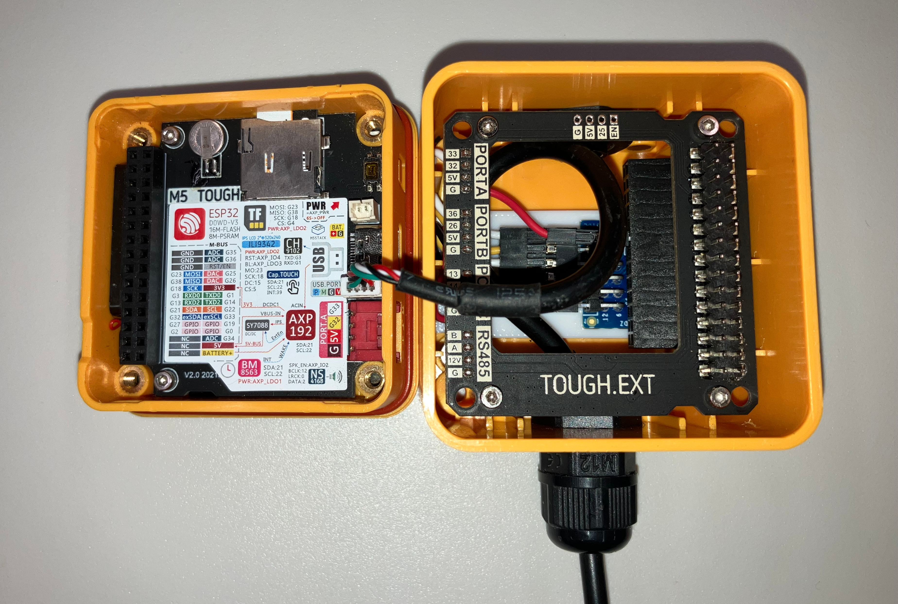
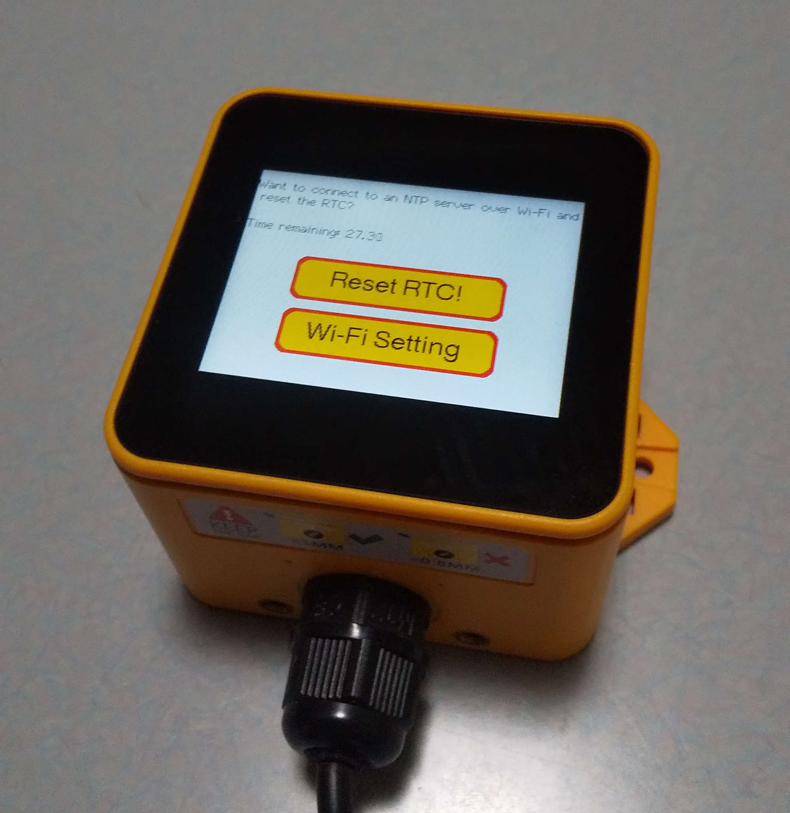

# MEMS Seismometer  

## Prerequisite
 - ADXL355 ([EVAL-ADXL355-PMDZ](https://www.analog.com/en/products/adxl355.html#product-overview))
 - [M5Stack Tough](https://docs.m5stack.com/en/core/tough) 
 - [modified version](https://github.com/T40O0/M5_ADXL355/tree/M5) of [plasmapper/adxl355-arduino](https://github.com/plasmapper/adxl355-arduino)  
Hats off to PL.

## Features
 - Cheap; can be made for about 100€.
 - Records three acceleration components (cm/sec/sec)
 - 100Hz sampling (with 50Hz high-cut FIR filter)
 - Stores files on TF card.
 - Dust and water resistant (Do not immerse the case in water or other liquids.)
 - UV-resistant plastic; can be used outdoors and in areas where acid gases are generated, such as volcanic regions.

## Installation
1. Connect ADXL355  

2. Set  
Mounting the ADXL355 into a [3D-printed frame](3D_model/frame.stl).  

3. Write  
The code can be uploaded to your board using the Arduino IDE.  
Before uploading, copy the [FIR filter file](into_library/) into your library folder.

## How to start
There are three options before the measurement starts.
1. Power On >> Wait 30 seconds >> Start
2. Power On >> RTC Reset >> Start
3. Power On >> Set Wi-Fi Access Point >> RTC Reset >> Start

## Note
 - RTC setting required; measurement will only start if RTC year is set between 2024 and 2025. Modify line 298 if necessary.  
   `while((dt.date.year < 2024) || (dt.date.year > 2025)) {`
 - If you can connect to Wi-Fi, touch a button "Reset RTC!" that appears on the startup screen. M5Tough will access any NTP server and start resetting the RTC. Just change lines 11-14 to suit your environment. Once completed, the measurement will start automatically.  
   `#define NTP_TIMEZONE  "your zone"`  
   `#define NTP_SERVER1   "your server1"`  
   `#define NTP_SERVER1   "your server2"`  
   `#define NTP_SERVER1   "your server3"`
 - If you are connecting M5Tough to Wi-Fi for the first time, or if you want to connect to a different Wi-Fi access point than the last time, touch "Wi-Fi Settings". You can change the Wi-Fi setting from  an "ESP Touch" app on your phone. The app will display the Wi-Fi access point your phone is connected to, so please enter the password, and it will be reflected on the M5Tough.
 - Data output from the ADXL355 at 500 Hz is decimated to 100 Hz. The supplied FIR filter is a 50 Hz high-cut filter for 500 Hz. If you want to change the frequency, create a new FIR filter file.
 - A file is created every minute (RTC based) and acceleration data is written to the file every 15 seconds (clock based). Because of the different counting bases, it rarely happens that one file contains 45 secondof data and the next file contains 75 seconds of data.
 - A "[hat](3D_model/hat.stl)" is recommended for outdoor use.
   - [x] Blocks sunlight and protects the LCD.
   - [x] Falling volcanic ash is washed away by rain.
 - Do not submerge the case in water or other liquids.

## Licence
This project is licensed under the MIT licence - see the [LICENSE file](LICENSE) for details.

