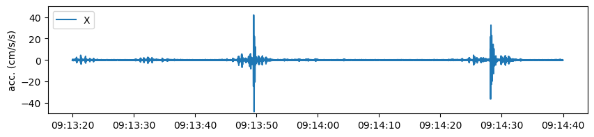

# MEMS Seismometer  

## Prerequisite
 - ADXL355 ([EVAL-ADXL355-PMDZ](https://www.analog.com/en/products/adxl355.html#product-overview))
 - [M5Stack Tough](https://docs.m5stack.com/en/core/tough) 
 - [modified version](https://github.com/T40O0/M5_ADXL355/tree/M5) of [plasmapper/adxl355-arduino](https://github.com/plasmapper/adxl355-arduino)  
Hats off to PL.

## Features
 - Three components of acceleration (cm/sec/sec)
 - 100Hz sampling (with 50Hz high-cut FIR filter)
 - Recording to TF card

## Installation
1. Connect ADXL355  

2. Set  
Mounting the ADXL355 into a 3D-printed frame.  

3. Write  
The code can be uploaded to your board using the Arduino IDE.  
Before uploading, copy the [FIR filter file](into_library/) into your library folder.

## Note
 - RTC setting required; measurement will only start if RTC year is set between 2024 and 2025. Modify line 135 if necessary.  
   `while((dt.date.year < 2024) || (dt.date.year > 2025)) {`  
 - Data output from the ADXL355 at 500 Hz is decimated to 100 Hz. The supplied FIR filter is a 50 Hz high-cut filter for 500 Hz. If you want to change the frequency, create a new FIR filter file.

## Licence
This project is licensed under the MIT licence - see the [LICENSE file](LICENSE) for details.

