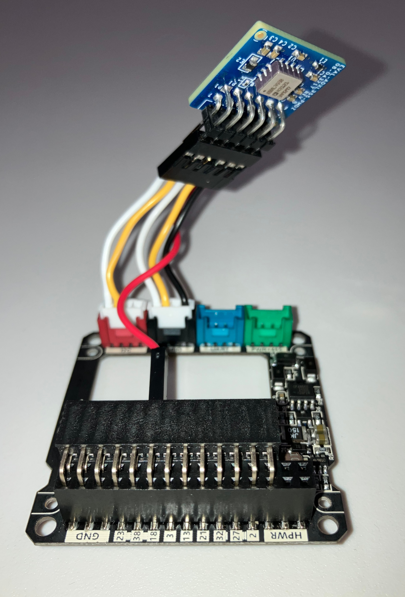
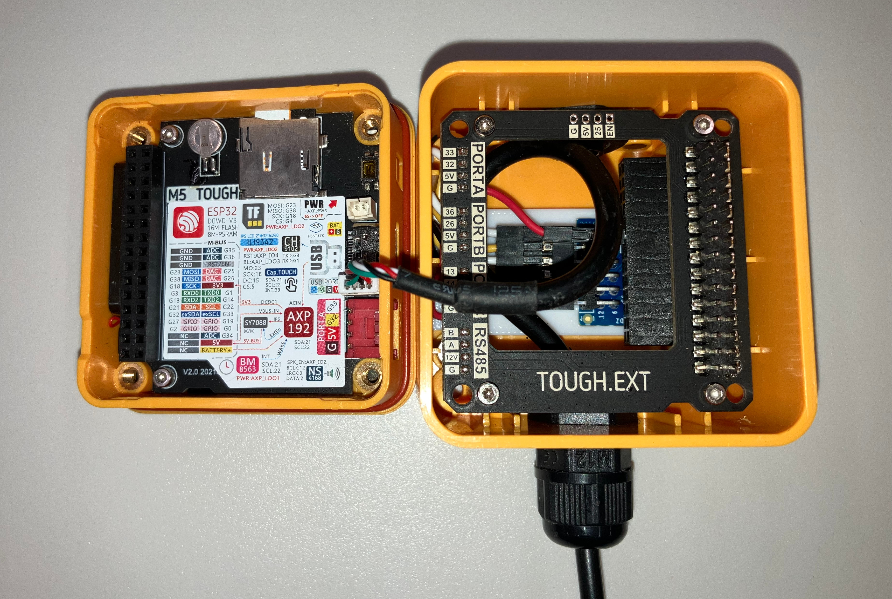

# MEMS Seismometer

## Prerequisite
 - ADXL355 ([EVAL-ADXL355-PMDZ](https://www.analog.com/en/products/adxl355.html#product-overview))
 - [M5Stack Tough](https://docs.m5stack.com/en/core/tough) 
 - [modified version](https://github.com/T40O0/M5_ADXL355/tree/M5) of [plasmapper/adxl355-arduino](https://github.com/plasmapper/adxl355-arduino)  
Hats off to PL.

## Features
 - Three components (xyz)  
 - 100Hz sampling (with 500Hz FIR filter)  
 - Recording to TF card

## Installation
1. Connect ADXL355  

2. Set  
Mounting the ADXL355 into a 3D-printed frame.  

3. Write Code  
The code can be uploaded to your board using the Arduino IDE.  
Before uploading, copy the [FIR filter file](into_library/) into your library folder.

## Licence
This project is licensed under the MIT licence - see the [LICENSE file](LICENSE) for details.

