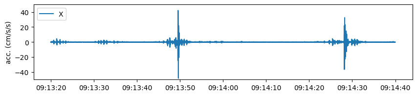
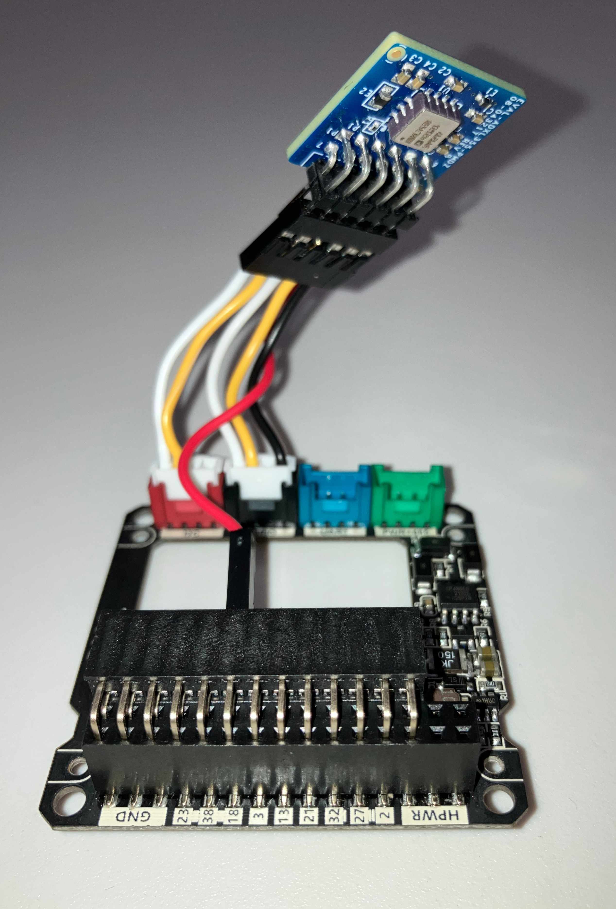
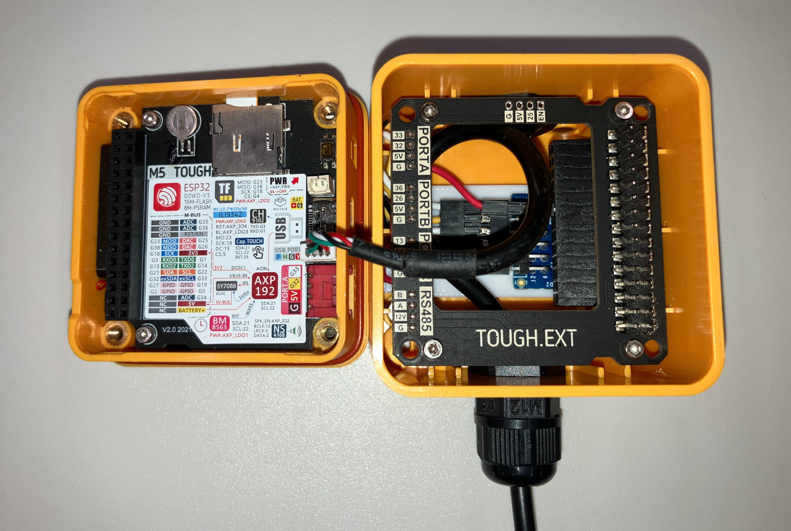
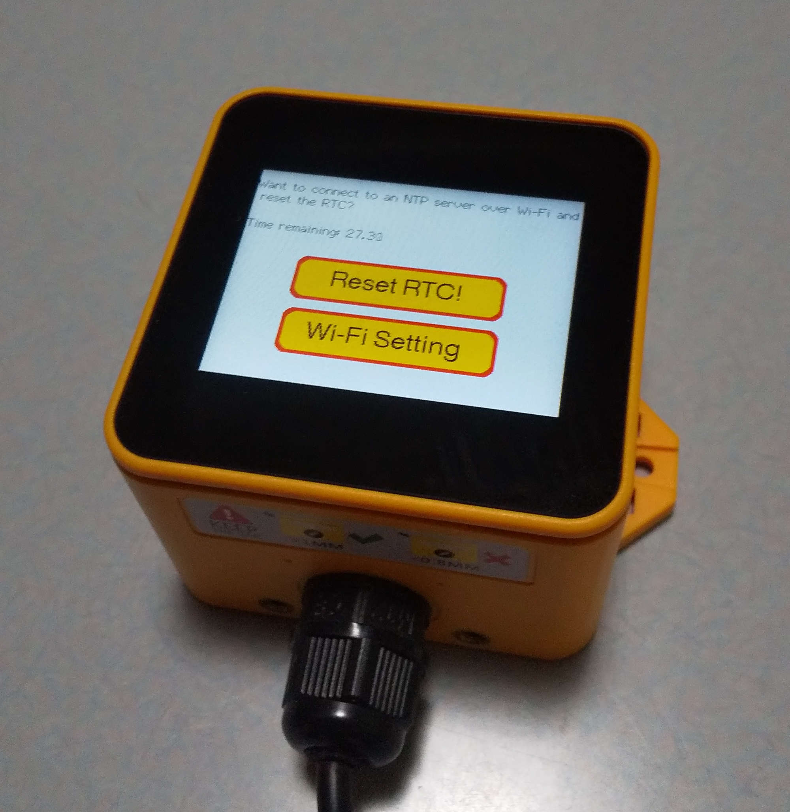

# MEMS Seismometer  


## Prerequisite
 - ADXL355 ([EVAL-ADXL355-PMDZ](https://www.analog.com/en/products/adxl355.html#product-overview))
 - [M5Stack Tough](https://docs.m5stack.com/en/core/tough)
 - [modified version](https://github.com/T40O0/M5_ADXL355/tree/M5) of [plasmapper/adxl355-arduino](https://github.com/plasmapper/adxl355-arduino)  
Hats off to PL.

## Features
 - Cost-effective: It can be made for about €100.
 - Records three acceleration components (cm/sec/sec).
 - Selectable output rate at compile time: **100 Hz** or  **500 Hz** .
 - Dual-core FreeRTOS pipeline (TaskRead on PRO_CPU, TaskSave on APP_CPU) decouples sampling from SD I/O.
 - One CSV file per minute on a TF card; daily folder layout (`/YYYYMMDD/HHMM.csv`).
 - Built-in Wi-Fi AP + FTP server for data retrieval (no SD card removal required).
 - Dust- and water-resistant (do not submerge the case in water or other liquids).
 - Made of UV-resistant plastic, so it can be used outdoors and in areas where acid gases are generated, such as volcanic regions.

## Installation
1. Connect ADXL355  


2. Set  
Mounting the ADXL355 into a [3D-printed frame](3D_model/frame.stl).  


3. Write  
The code can be uploaded to your board using the Arduino IDE.  
FIR coefficient files are bundled in the [`FIR/`](FIR/) subfolder of this sketch and included automatically.

## Sampling rate selection
At the top of the sketch, set the desired output rate:
```cpp
#define SAMPLE_HZ 100  // 100 or 500
```
- `100`: ADXL355 ODR=500 Hz, 201-tap FIR (`FIR/FIR500_cut50.csv`).
- `500`: ADXL355 ODR=1000 Hz, 80-tap minimum-phase FIR (`FIR/min500.cf`).

## How to start
On power-on, a startup screen with four options is shown for 30 seconds. Tap a button, or wait for the timer to elapse.

1. **Wi-Fi Setting** - SmartConfig (set or change the Wi-Fi access point), then NTP sync of the RTC.
2. **Reset RTC** - Connect to a saved Wi-Fi access point and resync the RTC via NTP.
3. **Manual Set** - Set RTC year/month/day/hour/minute/second on the touch screen (no Wi-Fi needed).
4. **Data Dump** - Start a SoftAP + FTP server. Connect a PC to the AP and pull files via Explorer.

After any of the above (or after the 30 second timeout), measurement begins at the next RTC second `00`.



## Note
 - **RTC year range**: measurements only start when the RTC year is in 2026..2099. Edit `setup()` if needed.  
   `while ((dt.date.year < 2026) || (dt.date.year > 2099)) {`
 - **NTP setup**: edit the defines near the top of the sketch to fit your environment.  
   `#define NTP_TIMEZONE  "your zone"`  
   `#define NTP_SERVER1   "your server1"`  
   `#define NTP_SERVER2   "your server2"`  
   `#define NTP_SERVER3   "your server3"`
 - **Wi-Fi setup (first time / new access point)**: choose **Wi-Fi Setting** on the startup screen, then use the *SmartConfig ESP* or *ESP Touch* app on your phone to push the SSID/password. The RTC reset proceeds automatically once the device is connected.
 - **Manual RTC**: use **Manual Set** when no Wi-Fi is available (e.g., remote field deployment). A 10-second confirmation screen is shown before measurement begins.
 - **Data Dump (FTP)**: choose **Data Dump** on the startup screen. The device acts as a SoftAP (`SSID: M5-SEISMO / PASS: m5seismo`). Connect a PC to the AP, then use a dedicated FTP client (**WinSCP**, **FileZilla**, or a web browser) at `ftp://m5:m5@192.168.4.1` to copy files. Tap the on-screen **Reset** button to return to the startup screen.
   - **Avoid Windows Explorer for the FTP transfer.** Explorer's built-in FTP shares the Internet Explorer cache and tends to keep stale copies of files across sessions, so freshly written data may not appear in the downloaded CSV even though the SD card itself is up to date. WinSCP / FileZilla / browsers fetch the current file every time and do not have this issue.
 - **FIR cutoff (100 Hz mode)**: the supplied 201-tap FIR cuts at 50 Hz for a 500 Hz input. Replace `FIR/FIR500_cut50.csv` to change the cutoff.
 - **FIR coefficients (500 Hz mode)**: this sketch ships with `FIR/min500.cf`, an 80-tap minimum-phase FIR (200 Hz passband / 250 Hz stopband at -120 dB) generated by [Telemetra-1](https://telemetra.jp/) and used here with permission. Replace `FIR/min500.cf` with your own minimum-phase 80-tap design (declared as `double min500[80] = {...};`) to change the response.
 - **File layout**: daily folders `/YYYYMMDD/` contain per-minute files `HHMM.csv`. Each file holds 60 seconds of data, aligned to the RTC second `00`. Data captured between power-on and the first sec=0 boundary is intentionally discarded so file timing matches the file name.
 - **Timestamp resolution**: the `Time(msec)` column is stamped with `millis()` at FIFO-drain time, which has 1 ms resolution. At 500 Hz (true Δt = 2 ms) this means consecutive samples often share the same millisecond (Δt = 0) or fall on adjacent millisecond ticks (Δt = 1–6 ms), producing visible local jitter even though the **per-file row count** (`hz × 60`) and the **total time span** (`last − first ≈ 60000 ms`) are both correct. Use these two aggregate metrics — not the per-sample Δt — to verify recording integrity.
 - A "[hat](3D_model/hat.stl)" is recommended for outdoor use.
   - [x] Blocks sunlight and protects the LCD.
   - [x] Falling volcanic ash is washed away by rain.
 - Do not submerge the case in water or other liquids.

## Licence
This project bundles components from multiple sources, each under its own licence:
 - **ADXL355 driver code**: based on [plasmapper/adxl355-arduino](https://github.com/plasmapper/adxl355-arduino) (PL) - see the upstream repository for its licence terms.
 - **`FIR/min500.cf` (500 Hz minimum-phase FIR)**: provided by [Telemetra-1](https://telemetra.jp/) - subject to Telemetra's own licence terms.
 - **All other original work in this repository** (sketch code, FIR/FIR500_cut50.csv, 3D models, etc.): MIT licence - see the [LICENSE file](LICENSE) for details.

When redistributing or modifying this project, please honour each component's respective licence.
